::: {#project_text}
For a Computational Social Science course in the Fall Semester of 2024 I have explored data from the Swiss parliament regarding the topic of data security and tried using OpenAI's chatGPT as a support for text classification. Here the results of this small project are summarized.
:::

## **General Idea**

Looking at data from the Swiss parliament such as businesses, and possibly corresponding session transcripts concerning the topic of data security and how to handle data produced (by the private sector). Roughly building on the concept by Fourcade and Healy (2024) of the Ordinal Society in which the measuring, ranking and ordering of people based on data is the underling concept [@fourcade2024]. In their work the concept of *eigencapital* is discussed. "We argue that the digital information available about an individual, accumulated over one's life and encapsulating the totality of her relations as expressed through digital traces, is a form of capital. In contrast to Bourdieu, we emphasize the growing technological inscription of this capital and its high dimensionality. Because of this, we call it eigencapital." [@fourcade] This is what sparked the interest in the topic and how this can be applied to Switzerland.

Research Question the main question I focus on is:

1.  How do the frequency of submitted business on individual data security within the Swiss Parliament change over time?

A simple hypothesis to test in that regard is that certain events do influence the frequency submitted. e.g. Peaks corresponding to the implementation of Open Government Data or the Cambridge Analytica scandal. I would expect peaks to be delayed based on the reactionary nature.

## **Methods**

The methods used from the computational science course are to some extent data collection via API. Luckily there has been a package created to access the Swiss Parliament API in a convenient way. The package swissparl is used to obtain the raw data of the businesses and other relevant data. This data then is prepared and descriptively analysed by visualizing the businesses overtime, in addition with a document frequency matrix, the most used words are looked at and used to get an overview of the selected businesses concerning the topic at hand.

Since filed of interest is fuzzy the selection of relevant businesses is equally unclear. Therefore the manual selection of businesses are additionally classified with the use of chatGPT as a text classification tool. The idea is to have it classify the selected text by providing a value indicating if the business falls into the field of interest. These different search methods are compared to have an idea of how good chatGPT can be used for classification.

words to look out for: Datenschutz, Digitalisierung, Bevölkerungsdaten, Open Data, Open Government Data, offene Verwaltungsdaten, Internetsicherheit

Lastly the text of the selected businesses get analysed using a structured topic model. In order to find if the sessions can be considered to fall into different distinct topics.

## **Process**

Preparation The first step after the general idea and RQ development was familiarizing myself with the API, data and the structures of both. Within this research I came across the swissparl package created by [@zumbach2020]. I also realized that the API I was first looking at is the old web services and that there is a newer one.

#### **Getting the data**

After getting familiar with the package swissparl [@zumbach2020] I found more businesses than via the old web service API I first used. In total there are 61838 entries in German.

#### **First look**

The provided tags gives a first overview of the data. In total there are 28 tags that can be accessed via the API as well. This helps to sort the business into different aspects unfortunately there is no tag concerned specifically with the digital domain. It is clear that over time the number of businesses increased that probably is due to the increased digitalisation and the better availability of data.

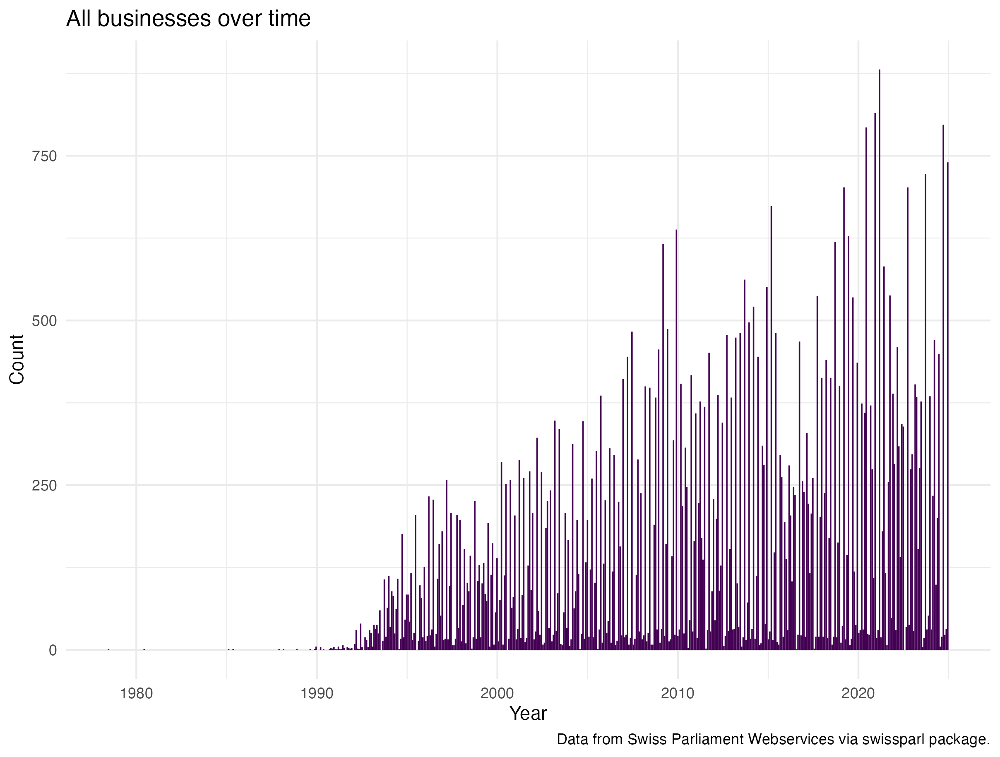

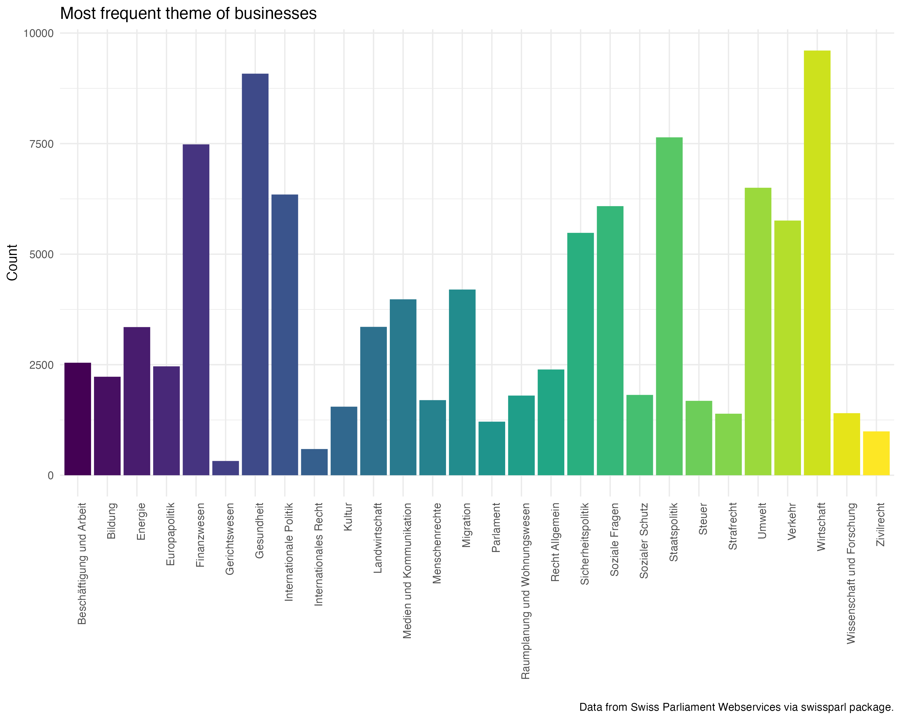

### **Preparation of raw data**

The preparation for the later selection followed these steps: Reducing the raw data set to the columns of interest. 1. Creating a corpus and tokenizing it, with most of the possible functions "switched off". With this there is more control over the steps. 2. Finding relevant collocations, first three word long and in a second step the two word collocations. The selection of the multiwords was done manually because the list was relatively short. 3. Removing punctuation, lower case, the removal of stop words and empty tokens, where the last steps done. The stemming of words was left out because I believe the titles of business are already short and the stemming could remove important information.

#### **Finding the relevant businesses**

The main focus is the selection. In order to do this effectively I have thought about words that are in some way connected to the topic of interest and are not too restrictive. In the first trails I realized that there are word containing parts of what I was search for: e.g. web is part of gewebe or daten is part of soldaten. Both not what I want to look at.

I therefore adapted the patter with word boundaries and quantifiers to restrict the search more. After some back and forth between adapting the regex pattern and looking at the output I additionally removed words I did not want to include but where still selected, such as soldaten or tier.

``` r
# 03.02 find the relevant businesses ---- 
search_pattern1 <- c("daten|datensicherheit|datenschutz|internet|online|digital|(web){1}\\b|\\b(KI){1}\\b|
                     open_government_data|cyber")
toks_daten_search1 <- kwic(toks, pattern = search_pattern1, 
                           valuetype = "regex",
                           window = 5,
                           case_insensitive = TRUE)

# filter for words that do not fit such as soldaten, tier 
toks_daten_search1_clean <- toks_daten_search1 %>%
  filter(!grepl("soldaten|tier", keyword))
    


# 03.02.01 Select the relevant variables form the search ----
toks_daten_search1_clean$ID <- as.numeric(toks_daten_search1_clean$docname)
business_search1 <- 
  inner_join(business_titles, 
             toks_daten_search1_clean,
             by = "ID") %>%
  select(-c(from, to, pre, pattern, post, docname, keyword))

business_search1 <- as.data.frame(business_search1) %>%
  mutate(broad = 1)

# remove duplicated rows 
sum(duplicated(business_search1$ID))  
duplicate_rows <- business_search1[duplicated(business_search1$ID) | duplicated(business_search1$ID, fromLast = TRUE), ]
business_search1 <- business_search1[!duplicated(business_search1$ID), ]

# save
save(business_search1, file = "./data/broad_search_businesses.RData")

# 03.02.02 Narrow down the search of relevant data ---- 
search_pattern2 <- c("daten|datensicherheit|datenschutz|\\b(KI){1}\\|cyber")
toks_daten_search2 <- kwic(toks, pattern = search_pattern2, 
                           valuetype = "regex",
                           window = 5,
                           case_insensitive = TRUE)

# add id and type of search indicator 
business_search2 <- as.data.frame(toks_daten_search2) %>%
  mutate(
    ID = as.numeric(docname),
    narrow = 1
  ) %>%
  select(c(ID, narrow))

# remove duplicated rows 
sum(duplicated(business_search1$ID))  
duplicate_rows <- business_search2[duplicated(business_search2$ID) | duplicated(business_search2$ID, fromLast = TRUE), ]
business_search2 <- business_search2[!duplicated(business_search2$ID), ]

# save 
save(business_search2, file = "./data/narrow_search_businesses.RData")


# clean work space remove what is no longer needed 
rm(col2, col3, col2_clean, duplicate_rows, multiword2, multiword3, search_pattern1, search_pattern2)

# 04. Explorations of manual search results  ----
# 04.01 Data preparation ----
# create a df with all variables for the business with an indicator of broad or narrow search
load("./data/broad_search_businesses.RData")
load("./data/narrow_search_businesses.RData")
business_search <- left_join(business_search1, business_search2, by = "ID") %>%
  mutate(narrow = coalesce(narrow, 0))
save(business_search, file = "./data/both_search_businesses.RData")
```

#### **Exploration of the selected businesses**

By comparing the two searches I was able to get a good overview of what it can mean. As expected the second more narrow search patter did result in fewer observations. More than half the observations of the broader search this shows a drastic difference and brings up the question of being to rigid.

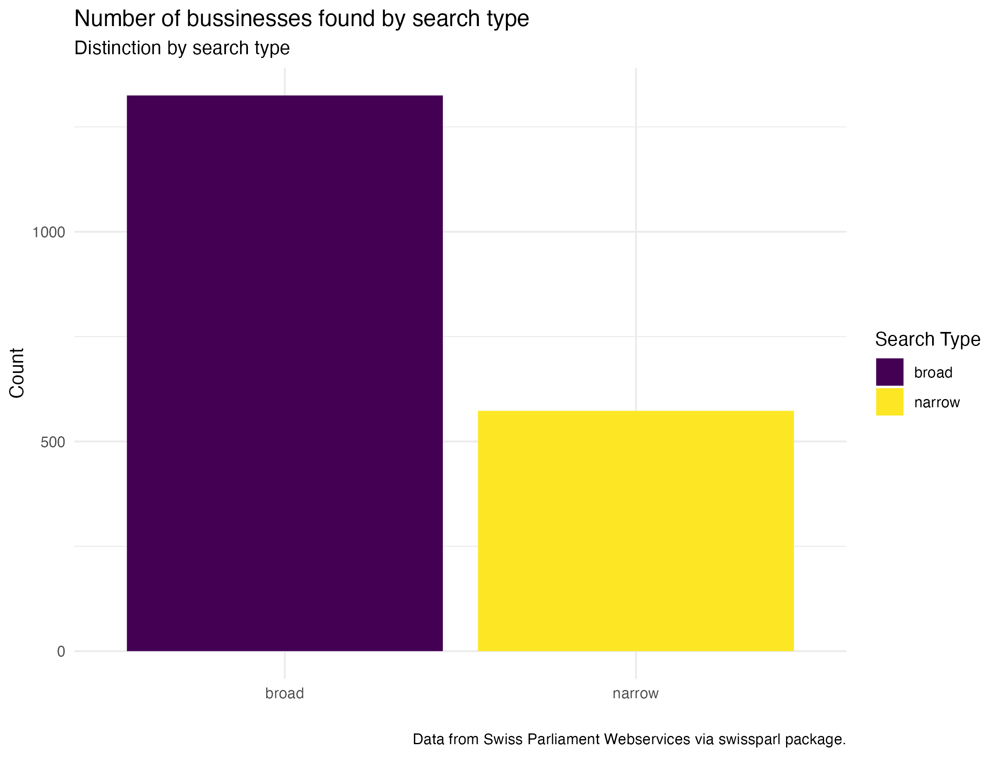{fig-align="center"}

#### **Businesses over time by year**

First look shows that there are some peaks around 2007, 2010, 2014, 2017 and 2021/22. These peaks are present in both of the search variants used the general number of businesses does vary but the overall pattern is similar except the peak around 2017 is no longer present with the narrow search. What could have been the difference? Another interesting point is around 2013 and 2014. Looking at the highest and lowest values there are definitely large differences per year but how does it look over time by sessions?

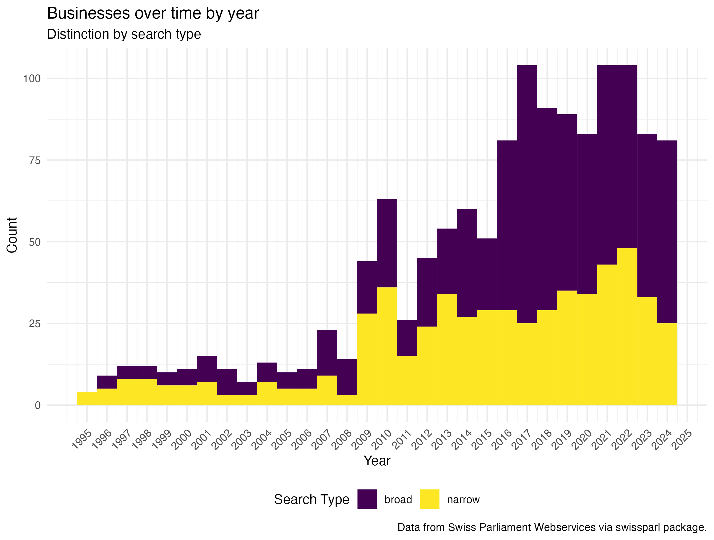{fig-align="center"}

#### Businesses over time by session

As one would expect the sessions with the most discussed are comparable with the years submitted. Not in all sessions the broad topic of data security is discussed to the same extent. There are some sessions with a high number of businesses discussed.

Some possible explanations:

-   2017 and 2018 Cambridge Analyitca scandal, Facebook data has been used to specifically target.

-   2021 and 2022 during and aftermath od the Covid-19 pandemic and the question of how e.g. contact data is handled.

-   2016 not sure why this is in the list

-   2013 for the narrow search not sure why this is in the list

-   2010 was the time when the discussion of Open Government Data in Switzerland was taking place.

#### **Most frequent words**

Comparing the most used tokens it is visible that the narrow search does have more words regarding financial topics, patient data, or tax data. The broader search seems to focus on concepts such as "bekämpfung", "gesundheitswesen" rather than topics focusing on individual data security. :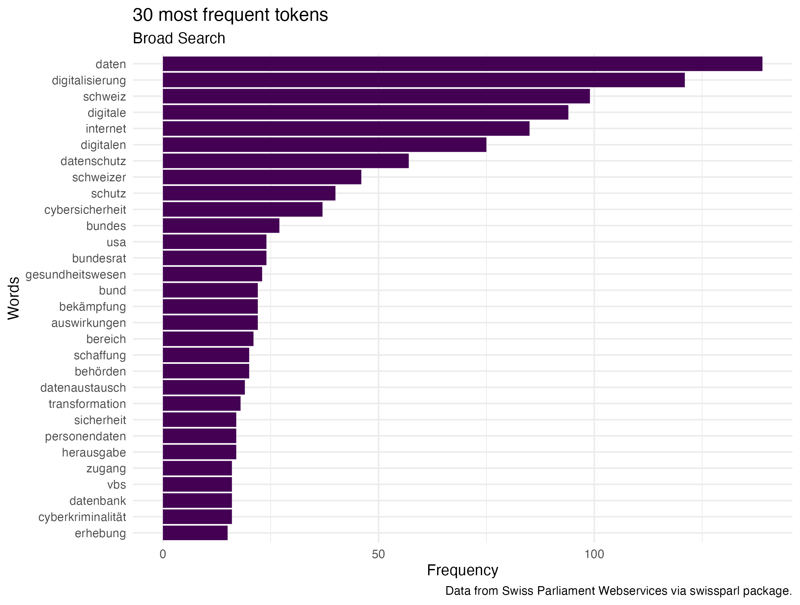

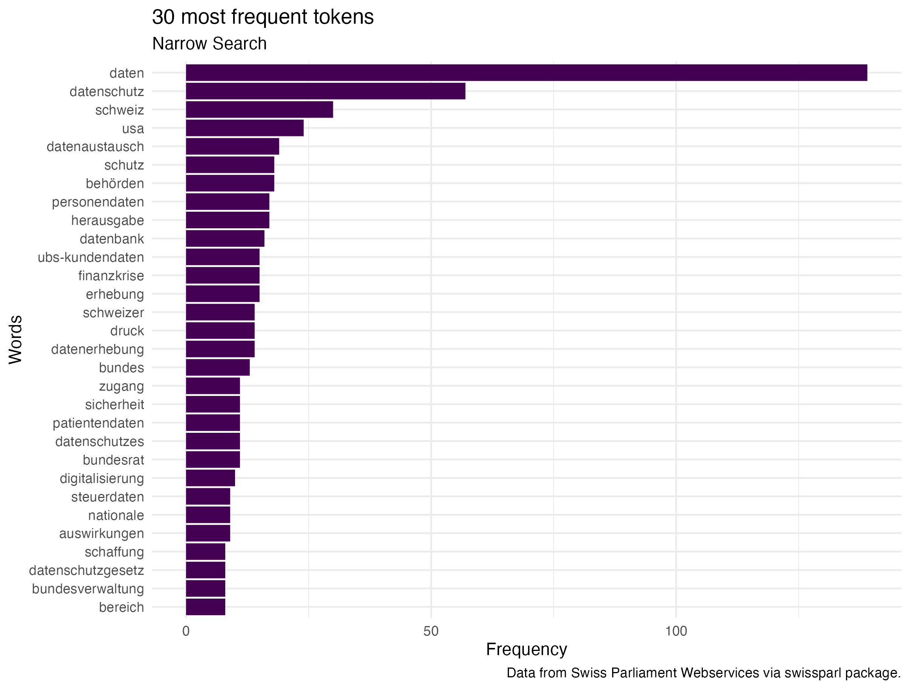

#### **Topic models**

This was based on the expectation or question if the sessions can be organised around topics. For this focused on the narrow search. The classic LDA model is not very helpful there is no clear topics based on the top 10 words of each topic. Therefore the idea is to look if the time component shows a difference between the 13 topics. Maybe there are some changes over time with peaks where the sessions would be?

Looking at the results of the structured topic model, all of the topics seem to be present over all the years except for topic 1 and 7. I would need to have done a more explorative approach to make some concrete assumptions but this first STM indicates that there are probably fewer topics and that in the beginning of the time line the topics are more district.

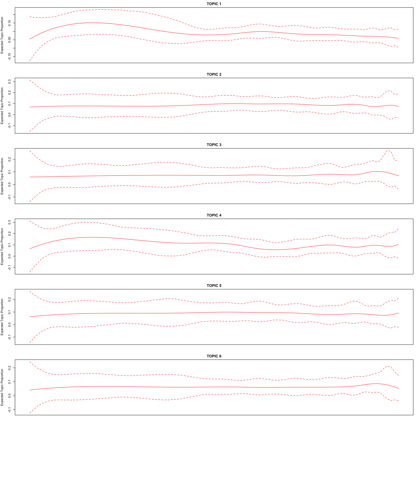{fig-align="center"}

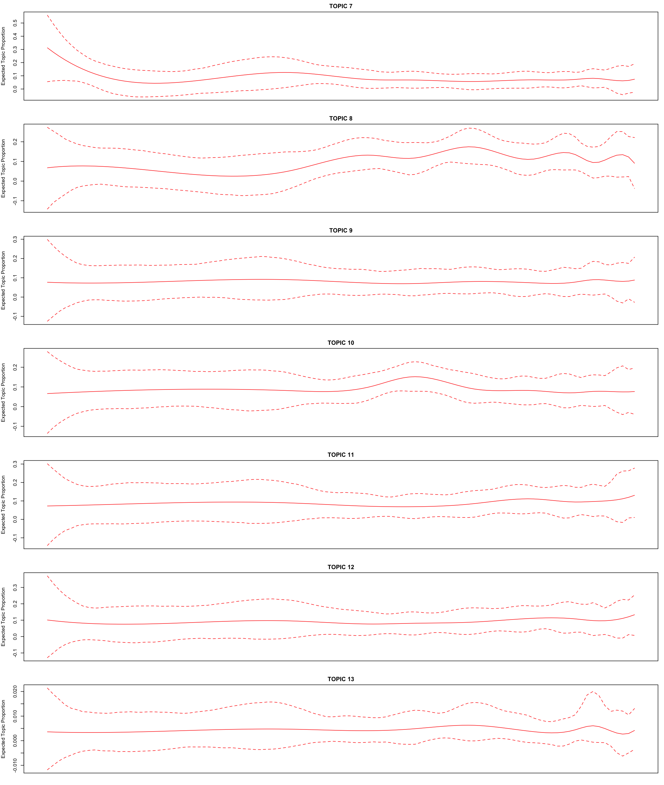{fig-align="center"}

### **Using chatGPT**

The first idea was to have chatGPT to classify all the business into 0 and 1 in order to compare it to the manually selected business. However, the API does have token limits that are exceeded by doing this. The tokens per month are 200'000 and all the business together wit the prompt where about 700'000 tokens. I therefore was unable to do this in the time frame. To find a solution on how I could still use chatGPT I calculated different possibilities and did settle on the idea to use it to get a "quality check" on the manually done selection.

``` r
# 05.03 chatGPT as a quality check ----
#  ChatGPT call with batches of text with a one minute pause 
# 05.03.01 preparation of batches 
load("./data/broad_search_businesses.RData")
text_batches <- business_search1 %>%
  mutate(text = paste0(ID, ": ", Title)) %>%
  select(text) %>%
  split(1:nrow(.) %/% 26 + 1) # Split into batches of 30 rows

# create empty list to store results
all_results <- list()

# 05.03.02 iteration over created text batches
for (i in seq_along(text_batches)) {
  batch <- text_batches[[i]]
  # The prompt for the current batch
  prompt <- paste0(
    "Allocate separately to the provided texts a value of 1 if \n",
    "it can be considered to talk about the data security of the Swiss Population, \n",
    "especially considering the definition eigencapital: We argue that the digital information available\n",
    "about an individual, accumulated over one's life and encapsulating the totality of her relations as \n",
    "expressed through digital traces, is a form of capital.\n",
    "If the provided texts do not fit into the before-described setting, set a value of 0.\n",
    "Provide the results while keeping the ID numbers in front of the : the texts provide.\n",
    "Finally, give a one-sentence reasoning for the classification.\n",
    "Output the response as JSON object keep the format the same for all outputs. 
    The output need to be in the following format:",
    "  \"id\": {\n",
    "      \"id\": ##,\n",
    "      \"reasoning\": ## text ##,\n",
    "      \"value\": ##\n",
    "  },\n",
    "Here are the texts to classify:\n",
    paste(batch$text, collapse = "\n")
  )
  
  # function askChatGPT
  answer_json <- askChatGPT(prompt = prompt, api_key)
  
  # clean JSON 
  cleaned_json <- gsub("^```json\\n|```$", "", answer_json)
  
  # save batches 
  write(cleaned_json, paste0("quality_check_batch_", i, ".json"))
  
  # append results 
  all_results[[i]] <- cleaned_json
  
  # pause for 1 minute to avoid overwhelming the API
  Sys.sleep(60)
}
save(all_results, file = "chatGPT_results.RData")

# 05.03.03 Getting the JSON Files into a dataframe ----
# Initialize an empty list to store data frames
all_batches <- list()

# Loop through the batches of classified data 
batch_number <- 1:51
for (i in batch_number) {
  
  json_file <- jsonlite::fromJSON(txt = paste0("quality_check_batch_", i, ".json"))
  batch_df <- do.call(rbind, lapply(json_file, as.data.frame))
  
  # append data frame to list
  all_batches[[i]] <- batch_df
}

gpt_classification <- do.call(rbind, all_batches) # make one df out 
save(gpt_classification, file = "gpt_classification.RData")
```

#### **Comparing the chatGPT and manual search**

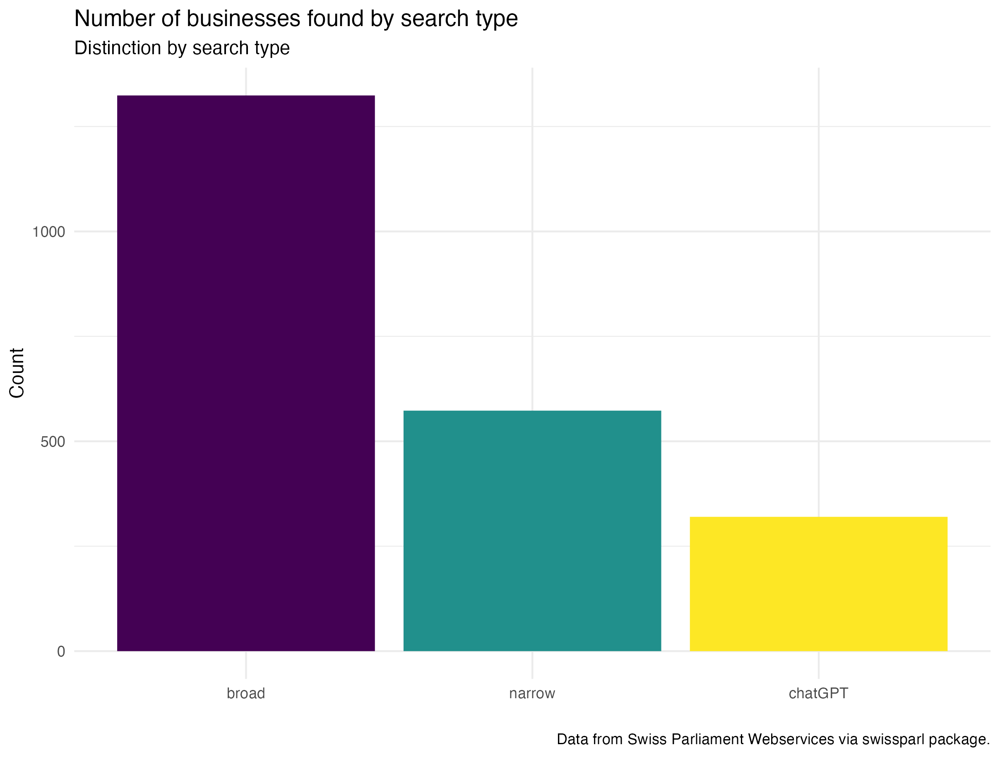{fig-align="center"}

#### **Businesses over time by year all three searches**

The peaks around 2010 and the Covid-19 Pandemic are still visible, when considering all three levels around that time the discussion or at least the number of submitted businesses concerning data security and individual data seems to be strongest.

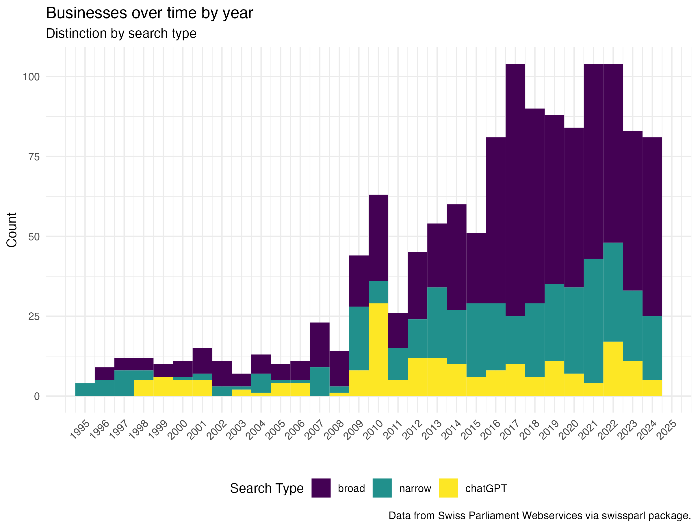{fig-align="center"}

#### **Businesses over time by session all three searches**

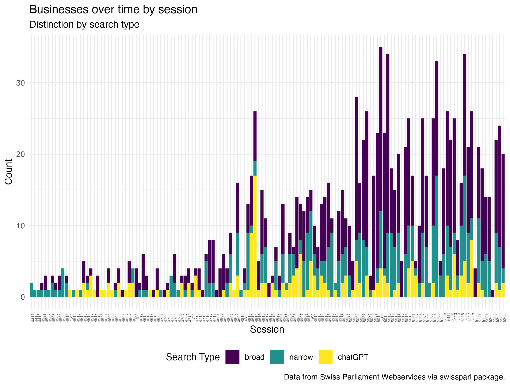{fig-align="center"}

## **Concluding remarks**

The analysis of the Swiss Parliament data is a good first exploration and gives somewhat good overview. Comparing different the three search types show that being to strict can result in a limited set of business to work with but this does not have to be bad the general pattern is still visible. However the analysis needs to be further developed to make concrete statements about the topic. The previous posed research question can be answered to some extent.

How do the frequency of submitted business on individual data security within the Swiss Parliament change over time?

The Sommersession 2010 is the one where in all three searches the frequency of businesses was the highest and as expected there are some peaks around years where there have been events raising questions on data security such as the Open Government Data debate (around 2010), the Cambridge Analytica Scandal (around 2018) and finally the Covid-19 pandemic (around 2021/22). Indicating that the Swiss Parliament is talking about and reacting to events. This link would need to be explored further. Over all there is a trend towards more businesses that include aspects of data security. Not surprising considering the social developments. It therefore sparked my interest to further engage in the topic of society and data.
